# RealtimeIRL React-based overlay
This overlay is designed to be used in [**OBS**](https://obsproject.com/) in conjunction with the [**RealtimeIRL**](https://rtirl.com/) app.

# Getting started

> [!CAUTION]  
> Existing users:  
> This app has been completely rewritten. Please read the documentation thoroughly.  
>
> Backup your `.env.local` file, delete your old copy of the app, then clone the repository again.
>
> Please take note of the new prefixes required in the `.env.local` file as described below, as well as the new URL parameters and ports, and update your browser source in OBS accordingly.

## Requirements
- `Mapbox` account and API key, which you can create here: https://www.mapbox.com/
- `OpenWeatherMap` account and API key, which you can create here: https://openweathermap.org/
- `RealtimeIRL` account and pull key, which you can create here: https://rtirl.com/
- `TimezoneDB` account and API key, which you can create here: https://timezonedb.com/

### Optional:
- `StreamElements` account and API key, which you can create here: https://streamelements.com/

# Installation:
[**Git**](https://git-scm.com/downloads) must be installed to clone the repository

From a terminal, run the following commands:
```bash
git clone https://github.com/scallensc/react-realtimeirl.git
cd react-realtimeirl
```

A `.env.local` file is <span style="color:red">**required**</span> in the root of the project folder.  
You can copy the `.env.example` file to `.env.local` and edit the values as required.  

<b>Required entries:</b>
```
VITE_MAPBOX_KEY = INSERTMAPBOXAPIKEYHERE
VITE_OPENWEATHER_KEY = INSERTOPENWEATHERMAPAPIKEYHERE
VITE_PULL_KEY = INSERTREALTIMEIRLPULLKEYHERE
VITE_TIMEZONE_KEY = INSERTTIMEZONEDBAPIKEYHERE
```
<b>Optional entries:</b>
```
VITE_STREAMELEMENTS_KEY = INSERTSTREAMELEMENTSAPIKEYHERE
```

## Easiest option - Docker:
You will need to install and configure [**Docker**](https://docs.docker.com/get-docker/).

> [!WARNING]  
> Ensure you have created the `.env.local` file as described above, before proceeding.
> You can copy the `.env.example` file to `.env.local` and edit the values as required.

Once **Docker Desktop** has been installed and the engine is running, from a terminal in the project root folder, you can build the image with the following command:
```bash
docker build -t react-realtimeirl .
```
You should see the following output:
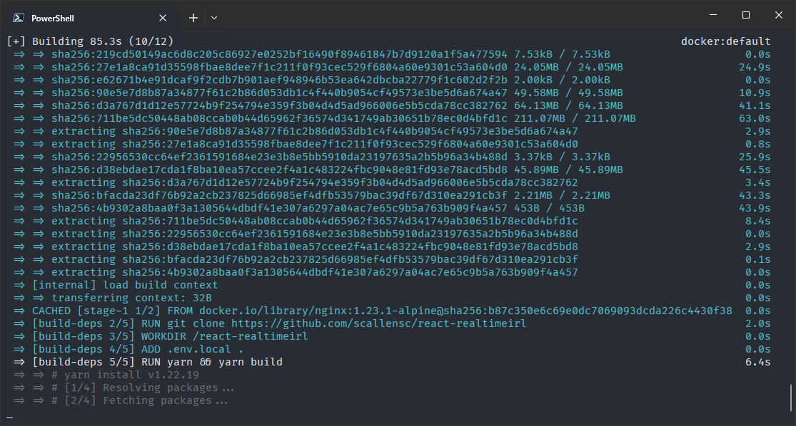

Now, you can run the image with the following command:
```bash
docker run --name react-realtimeirl -p 80:80 -d react-realtimeirl
```
You should see the following output: (the container ID will be different for you)
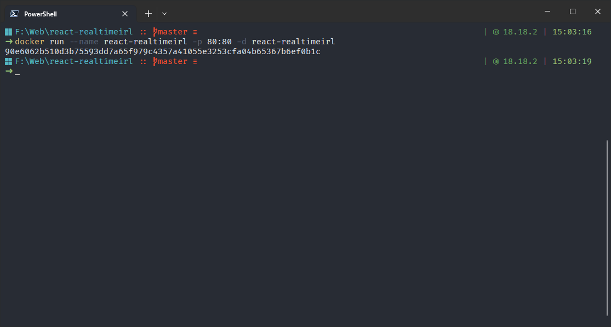

Please see the [docker documentation](https://docs.docker.com/) for more information on how to use docker, starting/stopping, how to prune containers, etc. 

### The overlay will now be running at http://localhost  

# OBS
Add a `browser source`  
Set the `URL` http://localhost  
Set the `Width` to `1920`  
Set the `Height` to `1080`  

All other settings should be left at default, but please ensure that both these values are ***unchecked***:  
`☐ Shutdown source when not visible`  
`☐ Refresh browser when scene becomes active`

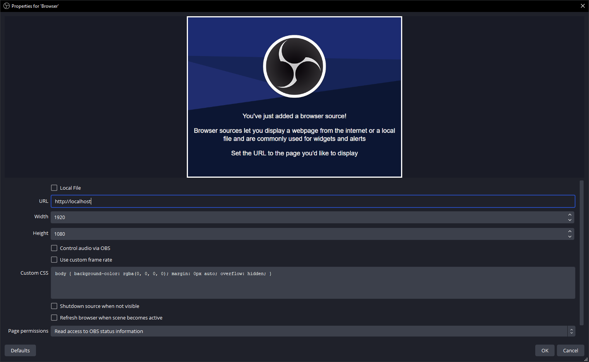

If you followed all of the instructions correctly up to this point, you should now see the overlay in OBS, start pushing data to the `RealtimeIRL` app, and you should see the overlay updating in real time.

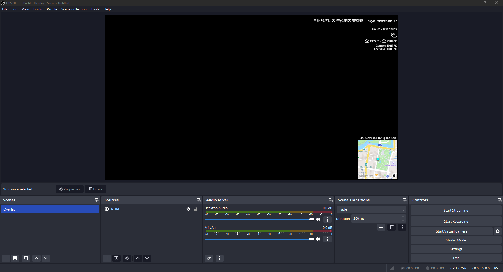
<b>Done!</b>  

## Self hosting option - Node:
You will need to install [**NodeJS (v18)**](https://nodejs.org/en/download), as well as [**Yarn**](https://classic.yarnpkg.com/en/docs/install).

After cloning the repository, you will need to install the dependencies, from a terminal in the project root folder, run the following command:
```bash
yarn
```
> [!NOTE]  
> Ensure you have created the `.env.local` file as described above, before proceeding.
> You can copy the `.env.example` file to `.env.local` and edit the values as required.

To start the app, run the following command:
```bash
yarn start
```

### The overlay will now be running at http://localhost:5173
Follow the above instructions to add the overlay to OBS, ensuring that `:5173` is added to the end of the URL in the browser source.

> [!WARNING]  
> Existing users:  
> Bundler changed from CRA to Vite, browser source URL changes from http://localhost:3000 to http://localhost:5173

# Customisation
URL parameters can be used for basic customisation of the output of the overlay. For more advanced customisation, you will need to edit the source code.  
Each component has a `.scss` file in the `src/components` folder, which you can edit to change the appearance of each part of the overlay.

### URL parameters:
To enable or disable display of various elements of the overlay, you can use URL parameters, these are described below. Add these to the end of the URL in your browser source in OBS.  

**Docker** e.g:   
`http://localhost/?theme=mapbox-japan&showMetrics=1&showHeartrate=1&showHeading=1&showAltitude=1&showDistance=1&showSpeed=1`

**Node** e.g:  
`http://localhost:5173/?theme=mapbox-japan&showMetrics=1&showHeartrate=1&showHeading=1&showAltitude=1&showDistance=1&showSpeed=1`

> [!NOTE]  
> The first parameter must be preceded by `?`, and all subsequent parameters must be preceded by `&`  
>  
> These parameters are only required if you wish to customise the default output.

> [!WARNING]  
> Existing users:  
> All flags have been changed and no longer need values unless specified below.  
> e.g.:  
> `disableAnimation=1` becomes `disableAnimation`  
> `mapZoom` still requires a value: `mapZoom=15`

#### Animation:  
- <b>disableAnimation</b> - disable the animation in/out of the location/weather <> streamelements data container  
  `disableAnimation`

#### Date/Time:
- <b>hideTime</b> - hide the time  
  `hideTime`

- <b>splitDateTime</b> - split the date and time into separate lines  
  `splitDateTime`

- <b>timeAtBottom</b> - move the date/time display below the map (looks bad with metrics enabled, might be good without)  
  `timeAtBottom`

#### Map:
- <b>hideMap</b> - hide the map  
  `hideMap`

- <b>mapFollowsHeading</b> - map display will rotate according to heading, instead of being fixed north  
  `mapFollowsHeading`

- <b>mapHasBorder</b> - add a border around the map  
  `mapHasBorder`

- <b>mapIs3d</b> - change to 3D map display  
  `mapIs3d`

- <b>mapIsCircular</b> - make the map circular instead of square  
  `mapIsCircular`

- <b>pulseMarker</b> - enable the pulse animation on the marker  
  `pulseMarker`

- <b>theme</b> - choose from available map themes (default is `mapbox-streets` - see bottom of this page for more info)  
  `theme=mapbox-streets`

- <b>zoom</b> - set the zoom level of the map (default is 14)  
  `zoom=14`

 - <b>zoomLevels</b> - specify zoom level/interval pairs to dynamically adjust map zoom  
  `zoomLevels=5-5,10-1,15-1` 
    - This example sets zoom level 5 for 5 minutes, then zoom level 10 for 1 minute, then zoom level 15 for 1 minute, then repeats

#### Metrics:

- <b>showMetrics</b> - enable metrics container (see below for options)
  `showMetrics`

- <b>useImperial</b> - use imperial units instead of metric  
  `useImperial`

#### Metrics container options:
- <b>showAltitude</b> - enable altitude  
  `showAltitude`

- <b>showDistance</b> - enable total distance  
  `showDistance`

- <b>showHeading</b> - enable heading  
  `showHeading`

- <b>showHeartrate</b> - enable heartrate  
  `showHeartrate`

- <b>showSpeed</b> - enable speed  
  `showSpeed`

#### Neighbourhood:

- <b>shortLocation</b> - use short location name instead of full info with POI, etc.  
  `shortLocation`

# Map themes:
Leaflet based map has been removed and replaced with Mapbox, which has a number of themes available.  

All default styles from https://docs.mapbox.com/api/maps/styles/ are available:  

  `theme=mapbox-dark`  

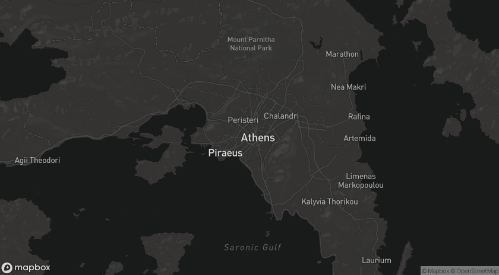

  `theme=mapbox-japan`

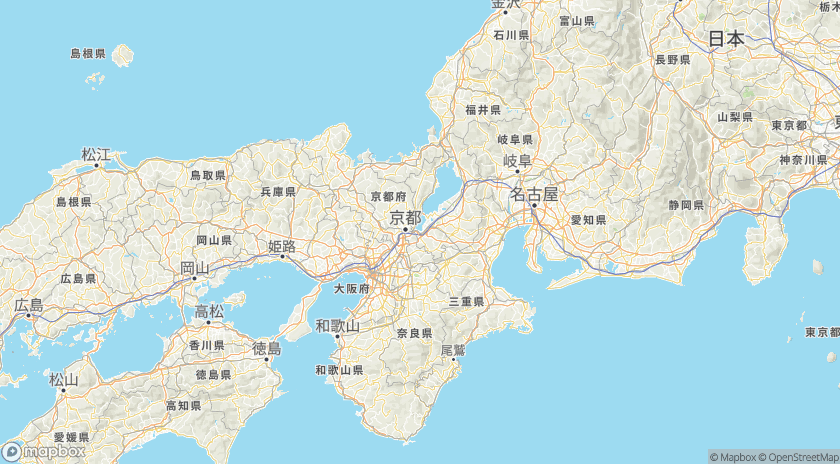

  `theme=mapbox-light`

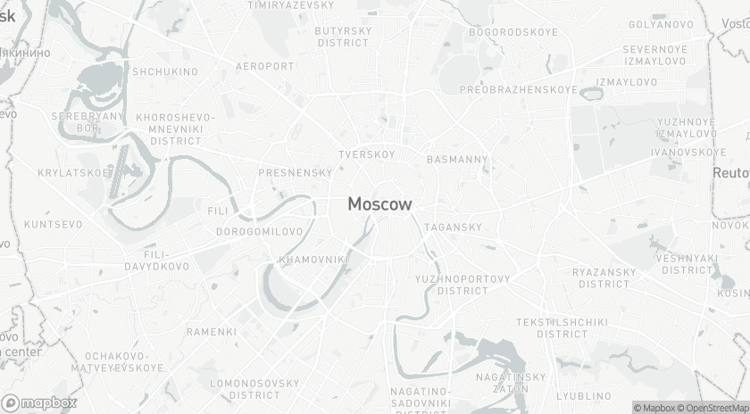

  `theme=mapbox-navigation-day`

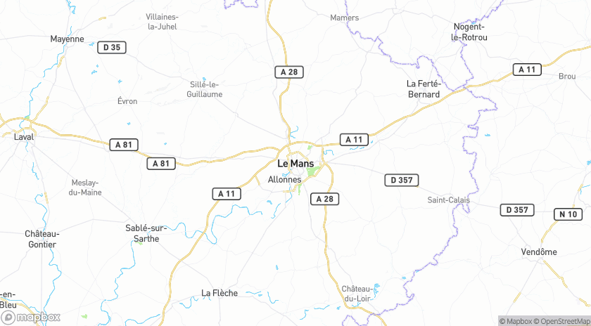

  `theme=mapbox-navigation-night`

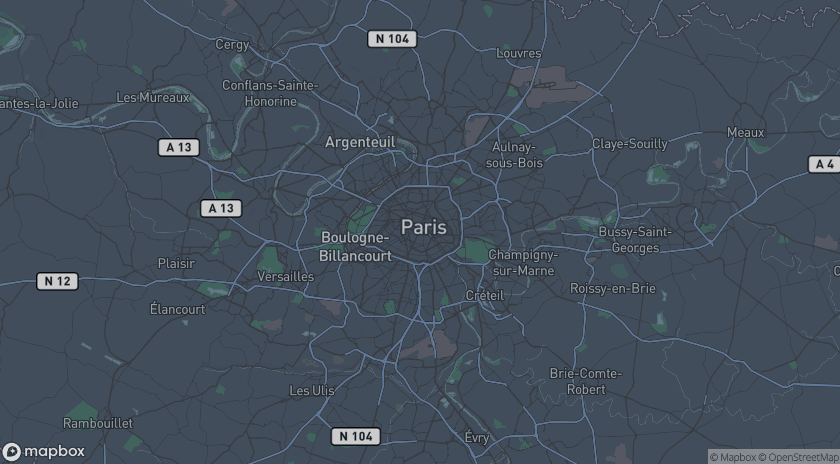

  `theme=mapbox-outdoors`

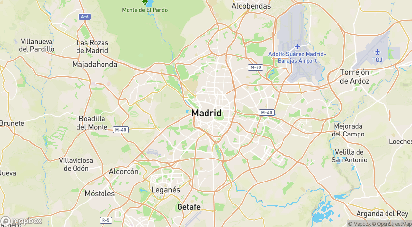

  `theme=mapbox-satellite`

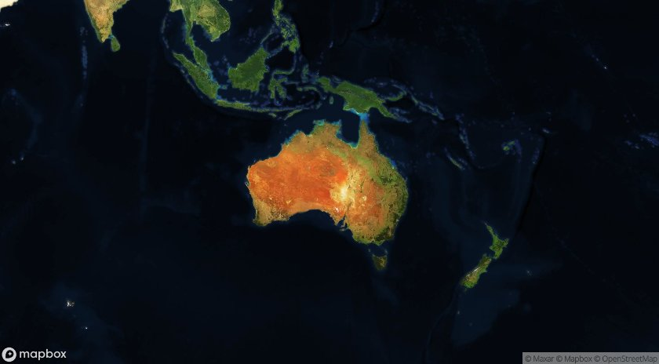

  `theme=mapbox-satellite-streets`

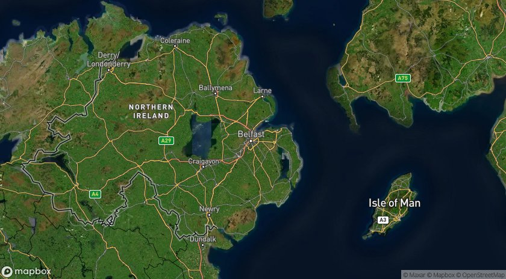

  `theme=mapbox-streets`

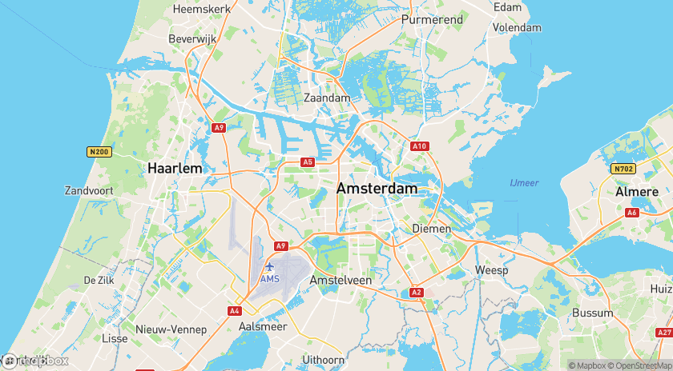

Additionally, the following themes from https://www.mapbox.com/gallery are available:  

  `theme=basic`

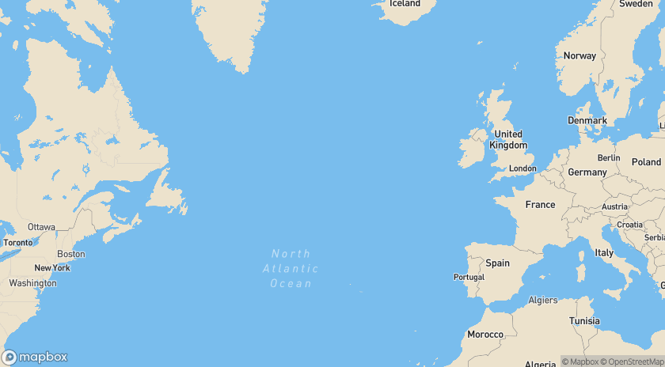

  `theme=basic-overcast`

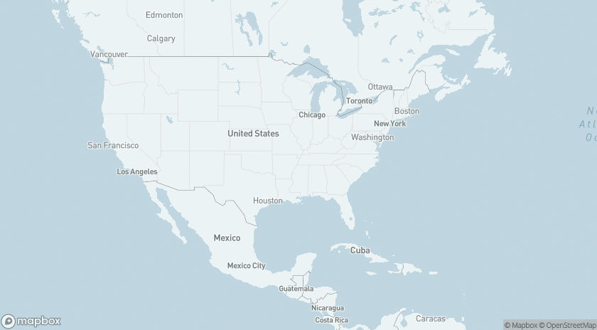

  `theme=blueprint`

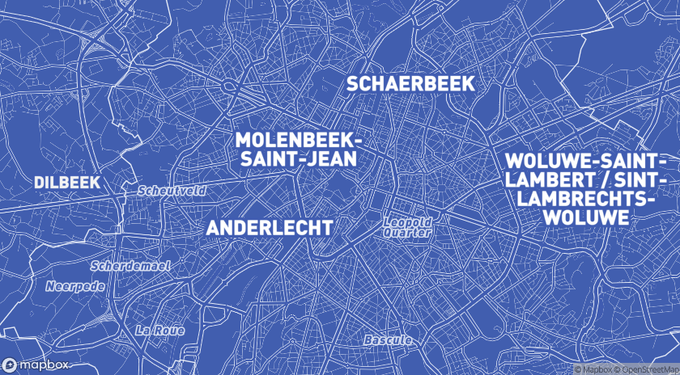

  `theme=frank`

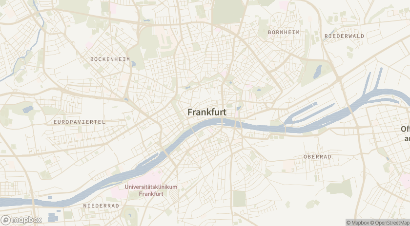

  `theme=minimo`

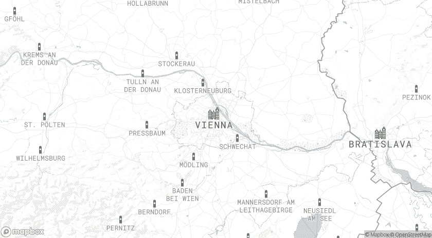

  `theme=standard-oil`

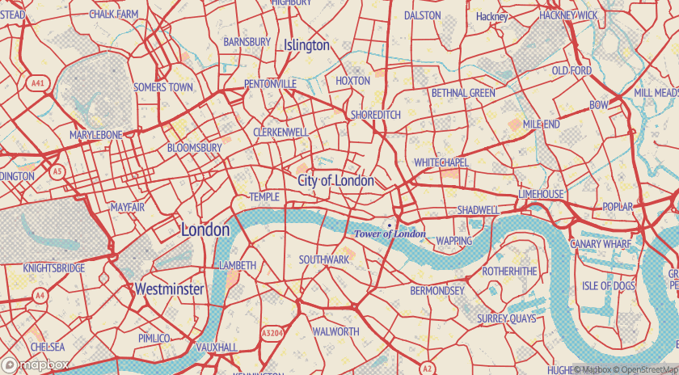

  `theme=unicorn`

  

Marvel themes from https://www.mapbox.jp/gallery are also available:

  `theme=marvel-americachaves`  
  
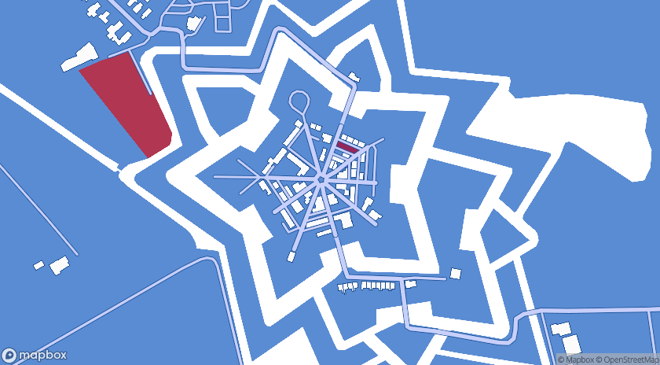

  `theme=marvel-blackwidow`  
  
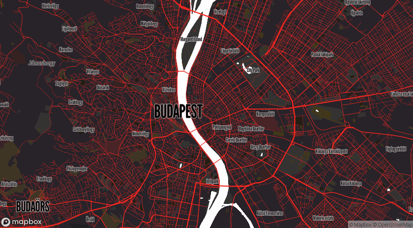

  `theme=marvel-blackpanther`  
  
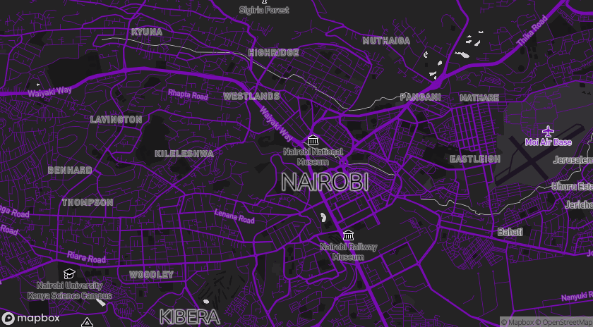

  `theme=marvel-captainamerica`  
  


  `theme=marvel-drstrange`  
  
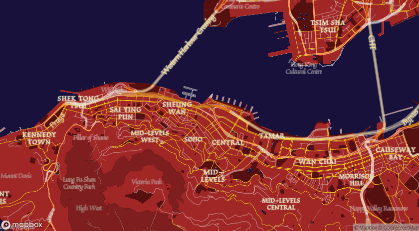

  `theme=marvel-hulk`  
  
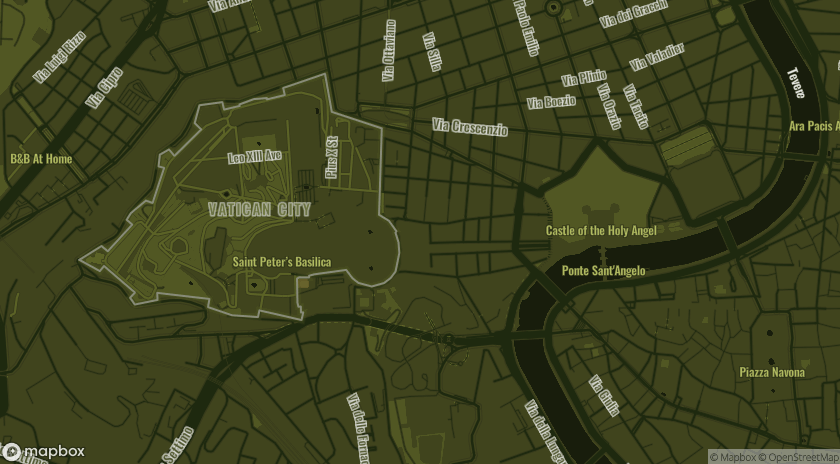

  `theme=marvel-ironman`  
  
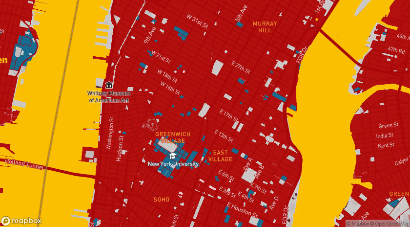

  `theme=marvel-thanos`  
  
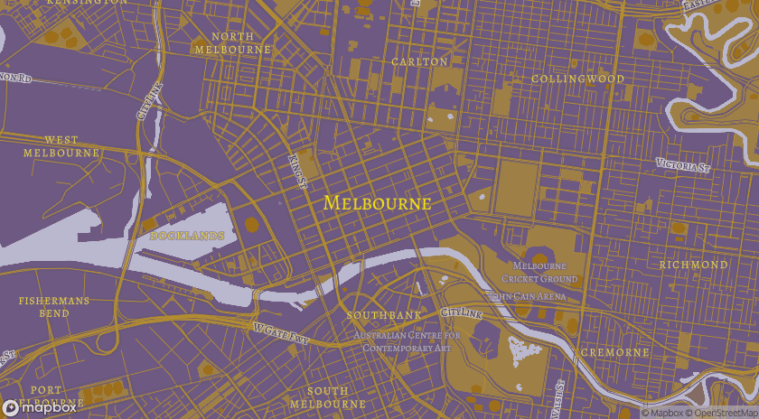

  `theme=marvel-wanda`  
  
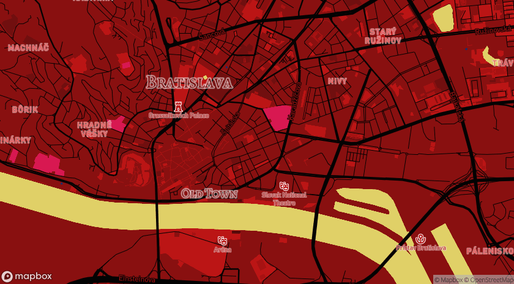


Custom themes can be created at https://studio.mapbox.com/  

You can then either add an entry to the `themes` object in `src/handlers/handleTheme.ts`, and pass the name of this entry as a URL parameter, or you 
can hardcode the value in `src/components/Map.tsx` in the `style` property here:  
```javascript
const map = new mapboxgl.Map({
  style: 'insert mapbox style url here, e.g. mapbox://styles/mapbox/dark-v11',
  center: [location.longitude, location.latitude],
  zoom: parseInt(mapZoom),
  pitch: mapIs3d ? 45 : 0,
  bearing: heading,
  container: mapContainer.current,
  antialias: true
});
```

***Example output with `theme=mapbox-dark`, `metrics` options and `mapIs3d` enabled:***

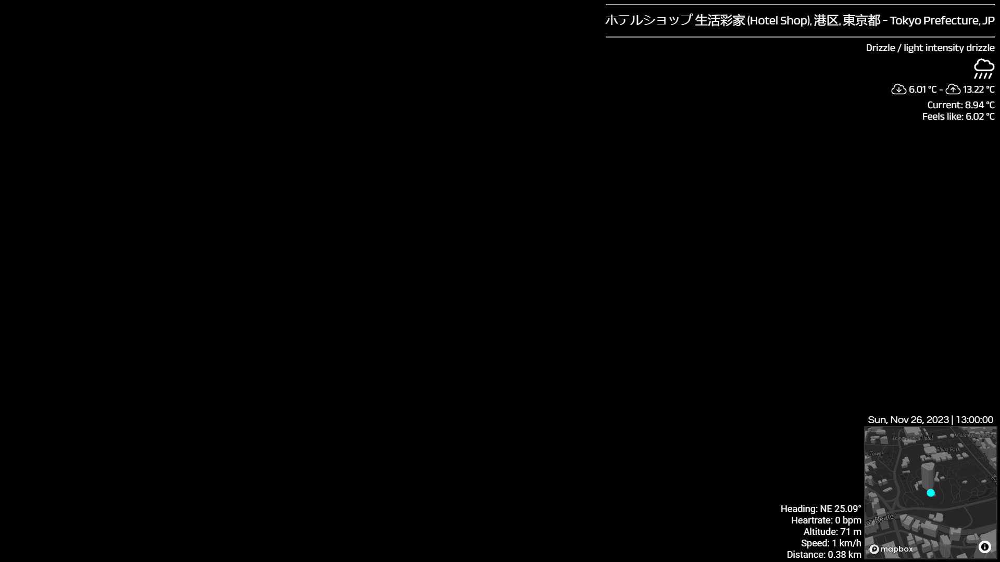