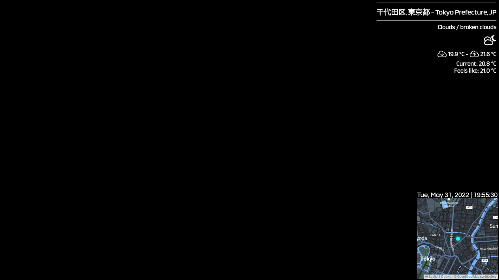

# RealtimeIRL React-based overlay system

## Getting started

## API Keys

#### Running locally

Firstly, you'll need to create a .env.local file in the root of this project directory, into which you'll need to insert:

```
REACT_APP_TIMEZONE_KEY = 'INSERT TIMEZONEDB API KEY HERE'
REACT_APP_LEAFLET_PROVIDER_KEY = 'INSERT LEAFLET PROVIDER KEY HERE' -- used for themes requiring API access keys, these are listed in the relevant section below
REACT_APP_MAPBOX_KEY = 'INSERT MAPBOX API KEY HERE'
REACT_APP_OPENWEATHER_KEY = 'INSERT OPENWEATHERMAP API KEY HERE'
REACT_APP_PULL_KEY = 'INSERT REALTIMEIRL PULL KEY HERE'
```

## Installation

You will need NodeJS v14+ installed, as well as yarn.

If you have Node installed, but not yarn, from an elevated command prompt, run:

`npm install -g yarn`

Clone the repository, and then at the command prompt in the root of the project folder, run:

`yarn`

Then:

`yarn start`

Then:

In OBS, add a browser source, pointed to http://localhost:3000 (Obviously, if building and serving from elsewhere, point it to there instead)  
Set the size to 1920x1080.

Done!

If you want to have a poke around at the data being pulled in, I'd suggest adding the React devtools extension to chrome/firefox etc, there you can view the state the app is pulling in - again, just navigate to http://localhost:3000 with the devtools installed in your browser of choice.

## Functionality

As the app stands with the current push, you'll receive a leaflet/mapbox map in the bottom right corner, zoomed to 13 (editable in the StateContext.js file), with the current date and time above it. In the top right, you'll receive the neighbourhood you're in according to my formatting preference, as well as current weather with icon, forecast min/max, etc. Both the neighbourhood and weather info are set to animate in at different intervals and animate out together, leaving a minimal clean overlay with just map and date/time for the most part.

I did create a rudimentary "metrics" component, which consumes the values for things like

- Altitude (metres)
- Speed (km/h)
- Heart rate (bpm)
- Heading (cardinal direction/degrees)
- Total distance travelled (km)

etc, etc.

These are not relevant to my streams, so they are set to not appear by default unless enabled with URL params flags, these are described below.

## Troubleshooting/editing

After you've installed the devtools, and confirmed your API keys are all working accurately, you should be able to see the "components" tab in your browser devtools, there you'll find a StateContext provider, which houses all the state given to the components found in this app.

Should you wish to change fonts, just visit https://fonts.google.com and use the "import" option after adding fonts of your choosing, then edit the App.scss file inside the /src folder with the import URL provided. Then edit the relevant "font-family" property in the scss file for a given component.

## Building/Hosting

To build, just run `yarn build` from the root of the project folder. copy the build folder to the web server of your choice. For the live version below, I've hosted it using a nodeJS/Express static server.

# Live version

## URL format for hosted version:

https://rlal.net/?timezoneKey=KEYHERE&mapboxKey=KEYHERE&pullKey=KEYHERE&weatherKey=KEYHERE&attribution=1.....etc.....&metrics=1

### Mandatory params:

- timezoneKey : https://timezonedb.com/api - generate an API key here
- mapboxKey : https://www.mapbox.com/ - generate a public token, not private
- pullKey : https://rtirl.com/ - generate your pull key here
- weatherKey : https://openweathermap.org/ - genrate an API key here
- attribution : leaflet and their theme providers require this to be set to on, so you should set this to 1

### Optional params (metrics):

- metrics - enable or disable metrics - metrics= 1 || 0

  - altitude - altitude= 1 || 0
  - distance - distance= 1 || 0
  - heading - heading= 1 || 0
  - heartrate - heartrate= 1 || 0
  - speed - speed= 1 || 0
  - imperial - imperial= 1 || 0 - use imperial units instead of metric

e.g.:  
https://rlal.net/?timezoneKey=KEYHERE.....etc.....&metrics=1&speed=1

<br/>

### Optional params (theme):

- leafletProviderKey : https://www.jawg.io/en/ - only used if selecting a Jawg theme, requires API key. May add other provider themes at a later date which also require API keys
- zoom : enter a number, used to determine zoom level of map component. Default is 13 if nothing entered
- theme : choose from one of the below themes, defaults to OpenStreetMap if nothing entered

e.g.:  
https://rlal.net/?timezoneKey=KEYHERE.....etc.....&theme=OpenStreetMap.France

```
Currently available themes:

OpenStreetMap
OpenStreetMap.DE
OpenStreetMap.CH
OpenStreetMap.France
OpenStreetMap.HOT
OpenStreetMap.BZH

OPNVKarte

CyclOSM

Jawg
Jawg.Streets
Jawg.Terrain
Jawg.Sunny
Jawg.Dark
Jawg.Light
Jawg.Matrix

Stamen
Stamen.Toner
Stamen.Watercolor
```

You can preview these themes here:

https://leaflet-extras.github.io/leaflet-providers/preview/

If you wish to add any not listed to your own build, follow the format found in `src/Functions/themeChooser.ts` to add.


